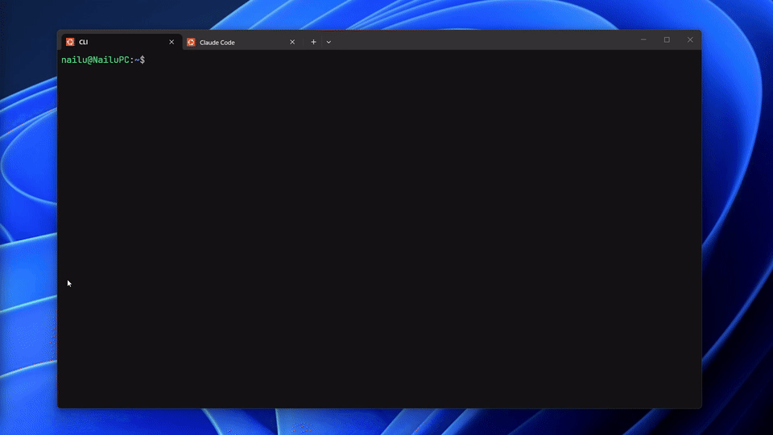
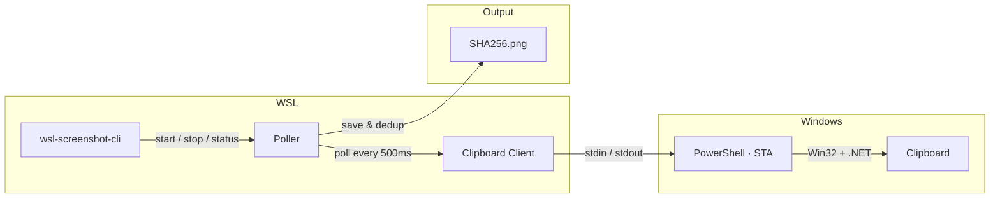

# wsl-screenshot-cli

CLI tool that monitors the Windows clipboard for screenshots, making them pasteable in WSL (e.g. Claude Code CLI, Codex CLI, ...) while preserving Windows paste functionality.

Take a screenshot on Windows, then paste in your WSL terminal — you get a file path. Paste in Paint — you get the image. Paste in Explorer — you get the file. All at the same time.



### Quick Start

```bash
wsl-screenshot-cli start --daemon   # start monitoring
wsl-screenshot-cli status           # check it's running
wsl-screenshot-cli stop             # stop monitoring
wsl-screenshot-cli update           # update to latest version
```

## Installation

### Quick install (recommended)

```bash
curl -fsSL https://raw.githubusercontent.com/Nailuu/wsl-screenshot-cli/main/scripts/install.sh | bash
```

This downloads the latest binary to `~/.local/bin/`. No Go toolchain required.

### Via Go

```bash
go install github.com/nailuu/wsl-screenshot-cli@latest
```

### From source

```bash
git clone https://github.com/Nailuu/wsl-screenshot-cli.git
cd wsl-screenshot-cli
go build -o wsl-screenshot-cli .
```

To start automatically with every WSL session, add to your `~/.bashrc`:

```bash
wsl-screenshot-cli start --daemon
```

## How It Works



A persistent `powershell.exe -STA` subprocess handles all clipboard access via a simple stdin/stdout text protocol (`CHECK` / `UPDATE` / `EXIT`). PowerShell calls `GetClipboardSequenceNumber()` (Win32) to skip clipboard reads when nothing has changed — zero contention with other apps.

When a new screenshot is detected, the poller:

1. Receives the image as base64 PNG from PowerShell
2. Deduplicates by SHA256 hash and saves to disk
3. Converts the WSL path to a Windows path via `wslpath -w`
4. Tells PowerShell to set three clipboard formats at once

### What Happens When You Paste

After a screenshot is captured, the clipboard contains three formats simultaneously:

| Where you paste | Clipboard format | What you get |
|---|---|---|
| WSL terminal (Ctrl+Shift+V) | `CF_UNICODETEXT` | File path: `/tmp/.wsl-screenshot-cli/<hash>.png` |
| Windows image app (Paint, etc.) | `CF_BITMAP` | The screenshot as an image |
| Windows Explorer / file dialog | `CF_HDROP` | The PNG file (paste-as-file) |

## Usage

### Start

```bash
# Foreground (useful for debugging)
wsl-screenshot-cli start

# Background daemon (typical usage)
wsl-screenshot-cli start --daemon

# Custom interval and output directory
wsl-screenshot-cli start --daemon --interval 1000 --output ~/screenshots/

# Debug mode — logs all PowerShell I/O
wsl-screenshot-cli start --verbose
```

| Flag | Short | Default | Description |
|---|---|---|---|
| `--daemon` | `-d` | `false` | Run as a background daemon |
| `--interval` | `-i` | `500` | Polling interval in ms (100–5000) |
| `--output` | `-o` | `/tmp/.wsl-screenshot-cli/` | Directory to store PNGs |
| `--verbose` | `-v` | `false` | Log all PowerShell I/O for debugging |

### Status

```bash
$ wsl-screenshot-cli status
Status:       running
PID:          12345
Uptime:       2h 15m 30s
CPU usage:    2.5%
Memory:       45.2 MB
Screenshots:  127
Output dir:   /tmp/.wsl-screenshot-cli/
Log file:     /tmp/.wsl-screenshot-cli.log
```

### Stop

```bash
wsl-screenshot-cli stop
```

### Update

```bash
wsl-screenshot-cli update
```

Updates to the latest release from GitHub. If the daemon is running, it will be stopped before updating. Re-running the install script when already on the latest version will skip the download.

## Prerequisites

- **WSL2** with Windows interop enabled
- **PowerShell** accessible from WSL (`powershell.exe` must be in PATH)
- **Go 1.25+** (only if building from source)

## Tests

### Requirements

- **Go 1.25+**
- **gcc** — required for the `-race` flag (cgo dependency). Install with:
  ```bash
  sudo apt update && sudo apt install -y gcc
  ```

### Running tests

Run the full suite with the race detector:

```bash
CGO_ENABLED=1 go test -race -count=1 -v ./...
```

Without gcc, you can still run tests without race detection:

```bash
go test -count=1 -v ./...
```

## Project Structure

```
├── main.go                        # Entry point
├── cmd/
│   ├── root.go                    # Root cobra command
│   ├── start.go                   # start command (flags, daemon/foreground)
│   ├── status.go                  # status command (process diagnostics)
│   ├── stop.go                    # stop command (SIGTERM)
│   └── update.go                  # update command (self-update via install script)
└── internal/
    ├── clipboard/
    │   ├── clipboard.go           # Go ↔ PowerShell client (stdin/stdout pipes)
    │   └── clipboard.ps1          # Embedded PowerShell script (Win32 clipboard)
    ├── daemon/
    │   ├── daemon.go              # Daemonize, PID management, lifecycle
    │   └── status.go              # /proc parsing (CPU, memory, uptime)
    ├── platform/
    │   └── platform.go            # WSL environment checks
    └── poller/
        └── poller.go              # Poll loop, SHA256 dedup, circuit breaker
```
